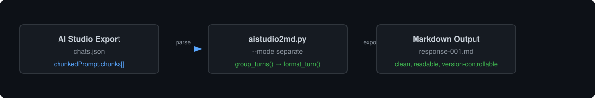

# aistudio2md

Convert Google AI Studio chat exports into clean, readable Markdown.

<picture>
  <source media="(prefers-color-scheme: dark)" srcset="assets/readme/flow-light.svg">
  
</picture>

## What it does

Google AI Studio lets you export chats as JSON, but that format is optimized for the UI — not for reading or sharing. This tool turns those exports into plain Markdown you can actually use.

- **Single file** — all turns in one `.md` document
- **Separate files** — one file per model response
- **Optional thinking** — include or exclude `thinking` sections via the `isThought` flag
- **Optional user prompts** — include or exclude user messages
- **Language-agnostic** — works for Persian, English, or any other language

## Quick start

```bash
git clone https://github.com/mshafiee/aistudio2md.git
cd aistudio2md
```

Requires Python 3.8+. No external dependencies.

## Usage

```bash
python3 aistudio2md.py --input exported.json --output ./chat-responses
```

### Options

| Flag | Description | Default |
|------|-------------|---------|
| `--mode single` | Export all turns into one `.md` file | `separate` |
| `--mode separate` | Export each turn as `response-001.md`, `response-002.md`, etc. | ✓ |
| `--include-user` | Include user prompts alongside model responses | `false` |
| `--include-thinking` | Include thinking sections from the export | `false` |

### Examples

**Separate files, model only, no thinking:**
```bash
python3 aistudio2md.py --input exported.json --output ./chat-responses
```

**Single file with everything:**
```bash
python3 aistudio2md.py --input exported.json --output chat.md --mode single --include-user --include-thinking
```

**Include user prompts in separate files:**
```bash
python3 aistudio2md.py --input exported.json --output ./output --include-user
```

## How it works

The AI Studio export contains a `chunkedPrompt.chunks` array. Each chunk has:
- `role`: `user` or `model`
- `text`: the content
- `isThought`: whether this is a thinking section

The script groups consecutive `model` chunks into turns, strips `isThought: true` sections by default, and writes clean Markdown.

## Input format

Download your chat from Google AI Studio. The file looks like:

```json
{
  "runSettings": { ... },
  "chunkedPrompt": {
    "chunks": [
      { "role": "user", "text": "..." },
      { "role": "model", "text": "...", "isThought": false }
    ]
  }
}
```

## License

MIT
